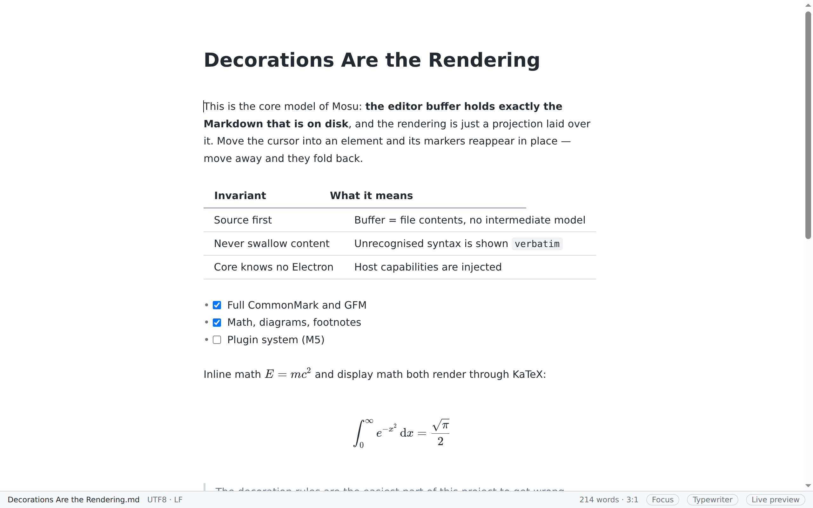
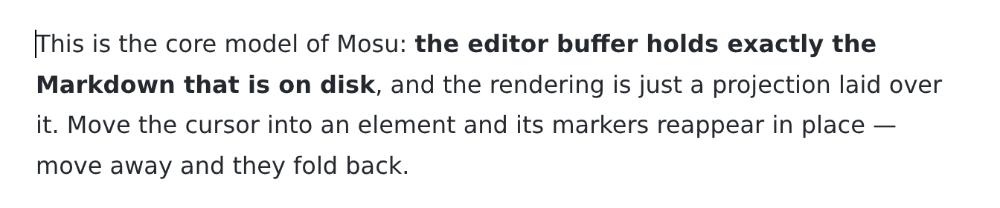
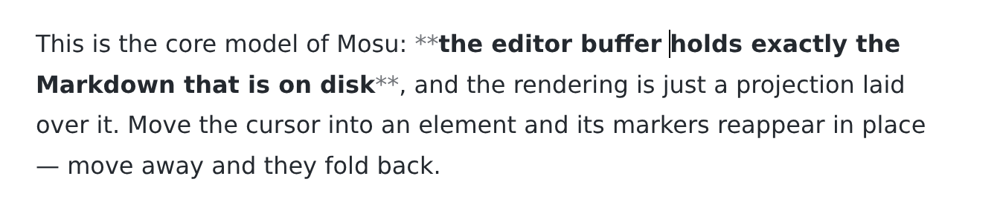

# Mosu

[简体中文](README.md) · **English** · [日本語](README.ja.md)

An open-source WYSIWYG Markdown editor — no split pane, no preview pane. What you type is what you see.

> **Status: milestones M2, M3 and M4 are done, and all six "hard problems" in M4.5 have landed.**
> GFM, math, diagrams, the outline panel, the command palette, crash recovery, six themes,
> HTML/PDF export, copy-as-rich-text, paste-HTML-as-Markdown, table editing, the file tree,
> tabs, session restore, the settings panel, inline HTML rendering and customisable shortcuts
> are all usable. Three of those six shipped as a **reduced-scope or different-approach**
> version; exactly what was cut is written down in the roadmap.
> Next up is the plugin system (M5).
>
> The repository name `open-typo-md` and the internal package scope `@mosu/*` are unchanged —
> they are not user-facing.

---

## What this is

Most Markdown editors put source on the left and a preview on the right. Mosu takes
the other road: there is a single editing surface where headings, bold text, links and images
are already in their final form. Only when the cursor enters an element do its Markdown markers
reappear in place, ready to edit.

The commercial product with a comparable experience is [Typora](https://typora.io/). This
project is an **independent implementation**: it reuses none of its code, assets or interface
materials, and borrows only the seamless live-preview interaction model.

<picture>
  <source media="(prefers-color-scheme: dark)" srcset="docs/public/shots/en/hero-dark.png">
  
</picture>

That screenshot is **taken by a script driving the real app** (`pnpm screenshots`), not a mockup —
the column widths and the typeset formula are computed by the product itself. When the UI
changes, one command regenerates it, so it cannot quietly go stale the way hand-taken
screenshots do.

**Markers appear only when the cursor arrives** — this is what separates it from
"source left, preview right":

| Cursor outside | Cursor inside |
| --- | --- |
|  |  |

## Design stances

| Stance | What it means |
| --- | --- |
| **The file is the truth** | The editor buffer holds exactly the Markdown on disk. No private intermediate model, no loss on the round trip |
| **Local first** | A workspace is just a folder. No account, no sync service, no lock-in |
| **An embeddable core** | The editor core is a plain web library that does not depend on Electron; browsers and other shells can reuse it |
| **Extensions are first-class** | Themes, syntax extensions and panels go through public APIs — the built-in features use the same ones |

## Quick start

Requires Node ≥ 20.19 and pnpm.

```bash
pnpm install
pnpm dev          # development build (HMR in the renderer; main/preload restart on change)
```

Other common commands:

```bash
pnpm test         # unit tests (includes the full CommonMark corpus for fidelity + invariants)
pnpm test:e2e     # end-to-end (real Electron + real Chromium, including IME cases)
pnpm verify       # what CI runs: layering + types + lint + format + unit tests
pnpm build        # build main / preload / renderer
pnpm --filter @mosu/desktop package     # build an installer for the current platform
```

On Linux the end-to-end tests need a display: `xvfb-run -a pnpm test:e2e`.

## What works today

- Live preview for all of CommonMark: headings, emphasis, inline code, links, images, lists,
  quotes, code blocks, rules
- Markers reveal when the cursor enters an element and fold back when it leaves; the cursor
  never lands inside markers it cannot see
- CJK input methods work inside decorated regions (guarded by a dedicated regression suite)
- Open / save / save-as, atomic writes, external-modification conflict detection
- Encoding and line-ending fidelity: open then save and the file is byte-identical
- Shortcuts for bold / italic / inline code / heading levels, list continuation on Enter,
  undo-redo, find and replace
- Ctrl/Cmd-click opens links in the system browser (a plain click only moves the cursor)
- One-key switch to source mode
- **Focus mode** (F8) dims everything outside the current block; **typewriter mode** (F9)
  keeps the current line at the vertical centre of the viewport
- **Interface language**: Simplified Chinese, English or Japanese, switchable in Settings
  without a restart
- **Multiple windows**, **tabs** (⌘T / ⌘W) with independent undo stacks and dirty flags,
  and **session restore**
- **Code blocks**: per-language highlighting, no wrapping with prose, block-level horizontal
  scrolling, a language picker in the corner
- **GFM**: tables that actually lay out as tables, clickable task lists, strikethrough,
  autolinks, footnotes
- **Math** (KaTeX) and **Mermaid diagrams**, both lazy-loaded
- **YAML front matter** with highlighting that does not swallow the document when unterminated
- **Images**: paste or drop to store them in an `assets/` folder beside the document
- **Outline panel** (⌘⇧E), **command palette** (⌘⇧P), **file tree** (⌘⇧B)
- **File watching** and **crash recovery** (drafts written on a 500 ms debounce)
- **Six themes** including a high-contrast one, with print styles
- **Export to HTML**: one self-contained file — styles, images, math fonts and diagram SVGs all
  inlined. Any `<script>` in the document is sanitised out
- **Export to PDF** via Chromium printing; paper size, orientation and margins are configurable
- **Copy as rich text** and **paste HTML as Markdown**
- **Table editing**: Tab between cells, insert/delete rows and columns, set column alignment,
  reflow. Every one of these is a plain text transformation, so undo is always correct
- **Settings panel** (⌘,) and **rebindable shortcuts** — press the combination you want;
  conflicts are flagged and the native menu updates immediately
- **Inline HTML rendering** for a closed set of attribute-free tags (`<b>` `<kbd>` `<sub>`
  `<mark>` `<br>` …). **Not one byte of HTML reaches the DOM** — only class names do

## Not there yet

- The plugin system (M5)
- Cross-file search (there is only find-and-replace within one file today)
- User theme directories with hot reload
- Pandoc-based export (DOCX / ePub / LaTeX)
- Block-level HTML rendering (`<div>…</div>`) — this one is a deliberate *no*, not a
  scheduling matter: its meaning lives almost entirely in attributes, and attributes are
  exactly what the "not one byte of HTML reaches the DOM" approach cannot cover
- Drag-to-resize table columns, PDF headers/footers and TOC page numbers, rename/create/delete
  in the file tree

Every rough edge is written down at the end of each milestone in the roadmap, under
"what actually differed from the plan". Nothing is swept under the rug.

## Trying the CI builds

Every push to `main` produces installers for all three platforms under
[Actions](https://github.com/zning1994/open-typo-md/actions). Note that the names shown there
(`mosu-macos-arm64-dmg` and the like) are **artifact bundle** names, not file names — GitHub
always zips artifacts, so unpack first.

**These builds are unsigned**, because the certificates are not configured yet.

**macOS** — you will see "Apple could not verify …". The app is fine, it simply is not
notarised. Two ways through:

```bash
# 1. Right-click the app → Open → click Open again in the dialog
# 2. Or strip the quarantine flag (the path contains a space, keep the quotes)
xattr -dr com.apple.quarantine "/Applications/Mosu.app"
```

**Windows** — SmartScreen says "Windows protected your PC"; click "More info" → "Run anyway".
This one is **deliberately left unsolved for now**: unlike macOS, signing does not by itself
stop the warning — an ordinary certificate has to accumulate install reputation first, and the
kind that works immediately is expensive and requires a cloud signing service.

**Linux** — make the AppImage executable first:

```bash
chmod +x Mosu-*.AppImage && ./Mosu-*.AppImage
```

## Repository layout

```
packages/
  plugin-api/   host interface and public types
  markdown/     lossless text codec, Lezer grammar config, outline derivation
  editor/       the live-preview core (decoration engine, commands, theme, table editing)
  import/       HTML → Markdown (rich-text paste)
  export/       Markdown → HTML (export, copy-as-rich-text, upstream of PDF)
apps/
  desktop/      the Electron shell (main / preload / renderer)
e2e/            Playwright end-to-end tests
docs/           design documents, architecture decision records, and the website
```

Dependencies flow strictly one way; `pnpm layers` enforces it in CI.

## Documentation

Website: <https://typo.ohgiantai.com>

**The design documents are written in Chinese and are not translated** — a deliberate
trade-off, not unfinished work. There are nine of them plus five architecture decision records,
and they change as development goes on; translating a moving target costs one translation per
revision, forever.

They are worth a machine translation if you are curious, because they are not feature lists.
They record trade-offs and mistakes — for example
[why CodeMirror 6 and not ProseMirror](docs/adr/0002-editor-core.md),
[why two Markdown parsers](docs/adr/0003-dual-parser.md), and
[a blank-page PDF bug on macOS chased through seven CI rounds](docs/design/06-export.md)
in which six conclusions were proposed and disproved before the real cause turned out to be a
single font.

## Contributing

Read [02 · Editor core](docs/design/02-editor-core.md) first (Chinese) — the decoration rules
are the easiest thing in this project to break, and that document explains why each one looks
the way it does.

Run `pnpm verify` before opening a PR. If you touch decoration rules, say what it does to
format fidelity.

## Licence

[MIT](LICENSE)
