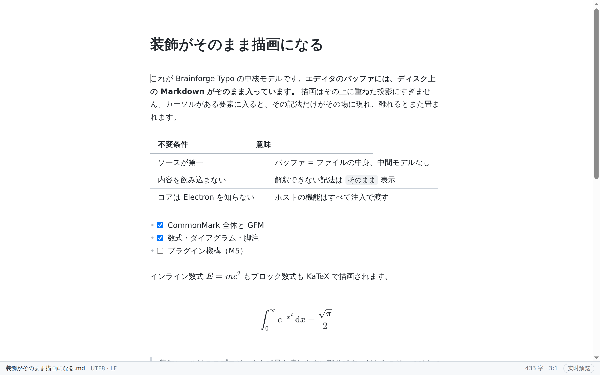
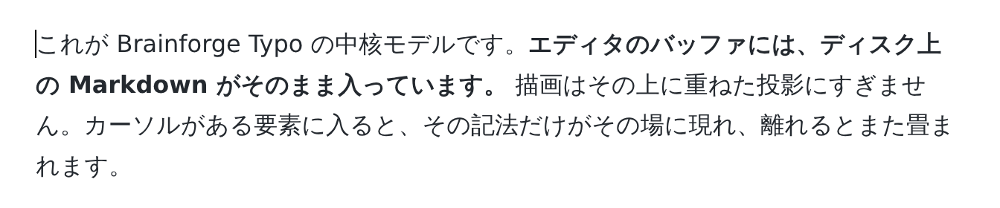
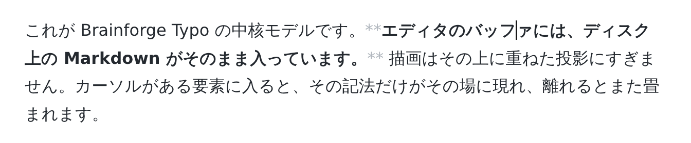

# Brainforge Typo

[简体中文](README.md) · [English](README.en.md) · **日本語**

オープンソースの WYSIWYG Markdown エディタ。分割ビューもプレビューペインもなく、書いたものがそのまま見えます。

> **状況：マイルストーン M2 / M3 / M4 が完了し、M4.5 の「難所」6 件もすべて着地しました。**
> GFM、数式、ダイアグラム、アウトライン、コマンドパレット、クラッシュ復旧、6 種類のテーマ、
> HTML / PDF 書き出し、リッチテキストとしてコピー、HTML を貼り付けて Markdown に変換、
> 表の編集、ファイルツリー、タブ、セッション復元、設定パネル、インライン HTML の描画、
> ショートカットのカスタマイズ —— ここまで使えます。6 件のうち 3 件は
> **範囲を絞った版・作り方を変えた版**であり、何を削ったかはロードマップに書いてあります。
> 次はプラグイン機構（M5）です。
>
> リポジトリ名 `open-typo-md` と内部パッケージ名 `@typo/*` はそのままです。
> どちらもユーザーから見える部分ではありません。

---

## これは何か

多くの Markdown エディタは「左にソース、右にプレビュー」です。Brainforge Typo は別の道を
選びました。編集領域はひとつだけで、見出し・太字・リンク・画像は最初から完成した見た目で
表示されます。カーソルがその要素に入ったときにだけ、Markdown の記法がその場に現れて
編集できるようになります。

同種の体験を提供する商用製品として [Typora](https://typora.io/) があります。本プロジェクトは
**独立した実装**であり、コード・素材・UI リソースを一切流用していません。借りているのは
「継ぎ目のないライブプレビュー」という操作のあり方だけです。

<picture>
  <source media="(prefers-color-scheme: dark)" srcset="docs/public/shots/ja/hero-dark.png">
  
</picture>

このスクリーンショットはモックではなく、**スクリプトが実際のアプリを起動して撮ったもの**です
（`pnpm screenshots`）。表の列幅も数式の組版も製品自身が計算した結果です。UI が変われば
コマンド 1 つで撮り直せるので、手で撮った画像のように知らないうちに古くなることがありません。

**カーソルが入ったときだけ、記法が現れる** —— これが「左にソース・右にプレビュー」との
決定的な違いです。

| カーソルが外 | カーソルが中 |
| --- | --- |
|  |  |

## 設計の立場

| 立場 | 意味 |
| --- | --- |
| **ファイルこそが真実** | バッファにはディスク上の Markdown がそのまま入る。独自の中間モデルはなく、往復で情報が落ちない |
| **ローカル優先** | ワークスペースはただのフォルダ。アカウントも同期サービスも不要、囲い込みもしない |
| **組み込めるコア** | エディタのコアは Electron に依存しない純粋な Web ライブラリで、ブラウザや他のシェルでも再利用できる |
| **拡張は一級市民** | テーマ・構文拡張・パネルはすべて公開 API 経由。組み込み機能も同じ API を使っている |

## クイックスタート

Node ≥ 20.19 と pnpm が必要です。

```bash
pnpm install
pnpm dev          # 開発ビルド（レンダラは HMR、main/preload は変更で自動再起動）
```

よく使うコマンド：

```bash
pnpm test         # ユニットテスト（CommonMark 全コーパスでの忠実性・不変条件チェックを含む）
pnpm test:e2e     # E2E（実際の Electron + Chromium、IME のケースを含む）
pnpm verify       # CI と同じ一式：レイヤ検査 + 型 + lint + フォーマット + ユニットテスト
pnpm build        # main / preload / renderer をビルド
pnpm --filter @typo/desktop package     # 現在のプラットフォーム向けインストーラを作成
```

Linux で E2E を動かすにはディスプレイが必要です：`xvfb-run -a pnpm test:e2e`。

## 今できること

- CommonMark 全体のライブプレビュー：見出し・強調・インラインコード・リンク・画像・
  リスト・引用・コードブロック・水平線
- カーソルが入ると記法が現れ、離れると畳まれる。見えない記法の中にカーソルが迷い込むことはない
- 装飾された領域の中でも日本語入力が正しく動く（専用の回帰テストで守っている）
- 開く / 保存 / 名前を付けて保存、アトミック書き込み、外部変更の競合検出
- 文字コードと改行コードの忠実性：開いて保存してもバイト単位で元のまま
- 太字 / 斜体 / インラインコード / 見出しレベルのショートカット、Enter でのリスト継続、
  取り消しとやり直し、検索と置換
- Ctrl / Cmd + クリックでシステムブラウザを開く（通常のクリックはカーソル移動のみ）
- ソースモードへのワンキー切り替え
- **複数ウィンドウ**、**タブ**（⌘T / ⌘W。取り消し履歴と変更フラグはタブごとに独立）、
  **セッション復元**
- **コードブロック**：言語ごとのハイライト、本文と一緒には折り返さない、ブロック単位の
  横スクロール、右上の言語セレクタ
- **GFM**：本当に表として組まれる表、クリックできるタスクリスト、打ち消し線、
  自動リンク、脚注
- **数式**（KaTeX）と **Mermaid 図**。どちらも遅延読み込み
- **YAML front matter**：閉じ忘れても文書全体を飲み込まないハイライト
- **画像**：貼り付け / ドロップで文書の隣の `assets/` に保存し、相対パスを挿入
- **アウトラインパネル**（⌘⇧E）、**コマンドパレット**（⌘⇧P）、**ファイルツリー**（⌘⇧B）
- **ファイル監視**と**クラッシュ復旧**（500ms デバウンスで下書きを書き出す）
- **6 種類のテーマ**（高コントラストを含む）と印刷用スタイル
- **HTML 書き出し**：単一の自己完結ファイル。スタイル・画像・数式フォント・図の SVG を
  すべてインライン化。文書内の `<script>` はサニタイズして除去
- **PDF 書き出し**：Chromium の印刷を利用。用紙・向き・余白は設定で変更可能
- **リッチテキストとしてコピー**、**HTML を貼り付けて Markdown に変換**
- **表の編集**：Tab でセル移動、行と列の挿入・削除、列の揃え、整形。いずれも純粋な
  テキスト変換なので、取り消しが常に正しく効く
- **設定パネル**（⌘,）と**ショートカットの再割り当て** —— 使いたい組み合わせをそのまま
  押すだけ。衝突は表示され、ネイティブメニューも即座に追従する
- **インライン HTML の描画**：属性のない限定されたタグだけ（`<b>` `<kbd>` `<sub>`
  `<mark>` `<br>` など）。**HTML は 1 バイトも DOM に入りません** —— 入るのはクラス名だけです

## まだないもの

- プラグイン機構（M5）
- ユーザーテーマディレクトリとホットリロード
- ブロックレベル HTML の描画（`<div>…</div>` —— その意味はほぼ属性にあるため）
- 表の列幅のドラッグ、PDF のヘッダー / フッターと目次のページ番号、
  ファイルツリーからの名前変更 / 新規作成 / 削除

粗い部分はすべて、ロードマップの各マイルストーン末尾「計画と実際に何が違ったか」に
書き出してあります。隠している未完成はありません。

## CI ビルドを試す

`main` へのプッシュごとに 3 プラットフォーム分のインストーラが
[Actions](https://github.com/zning1994/open-typo-md/actions) に生成されます。そこに表示される
`typo-macos-arm64-dmg` などは**成果物バンドル**の名前であってファイル名ではありません。
GitHub は成果物を必ず zip にするため、展開してから使ってください。

**これらのビルドは署名されていません。** 証明書をまだ用意していないためです。

**macOS** —— 「"Brainforge Typo" は Apple によって検証できません」と表示されます。アプリに
問題があるのではなく、公証を通していないだけです。通す方法は 2 つ：

```bash
# 1. アプリを右クリック → 「開く」→ ダイアログでもう一度「開く」
# 2. または quarantine 属性を外す（パスに空白があるので引用符は必須）
xattr -dr com.apple.quarantine "/Applications/Brainforge Typo.app"
```

**Windows** —— SmartScreen が「WindowsによってPCが保護されました」と出すので、
「詳細情報」→「実行」を選んでください。これは**意図的に未対応**です。macOS と違い、
署名しただけでは警告は消えません。通常の証明書はインストール実績を積むまで効かず、
即座に効く種類の証明書は高価なうえクラウド署名サービスが必要になります。

**Linux** —— AppImage には実行権限が必要です：

```bash
chmod +x BrainforgeTypo-*.AppImage && ./BrainforgeTypo-*.AppImage
```

## リポジトリ構成

```
packages/
  plugin-api/   ホスト側インターフェースと公開型
  markdown/     可逆なテキスト変換、Lezer 文法設定、アウトライン導出
  editor/       ライブプレビューのコア（装飾エンジン、コマンド、テーマ、表の編集）
  import/       HTML → Markdown（リッチテキストの貼り付け）
  export/       Markdown → HTML（書き出し、リッチテキストコピー、PDF の上流）
apps/
  desktop/      Electron シェル（main / preload / renderer）
e2e/            Playwright の E2E テスト
docs/           設計ドキュメント、ADR、そしてウェブサイト
```

依存の向きは厳密に一方向で、CI の `pnpm layers` が強制しています。

## ドキュメント

ウェブサイト：<https://typo.ohgiantai.com>

**設計ドキュメントは中国語で書かれており、翻訳していません。** 未完成なのではなく意図的な
判断です。設計ドキュメントは 9 本、ADR が 5 本あり、しかも開発の進行に合わせて変わり続けます。
動き続ける文書の翻訳コストは「1 回」ではなく「改訂のたびに言語の数だけ」で、払い続けられません。

とはいえ機械翻訳してでも読む価値はあります。機能一覧ではなく、取捨選択と失敗の記録だからです。
たとえば
[なぜ ProseMirror ではなく CodeMirror 6 か](docs/adr/0002-editor-core.md)、
[なぜ Markdown パーサーを 2 つ使うのか](docs/adr/0003-dual-parser.md)、
[macOS で PDF が白紙になる不具合を CI 7 周かけて追った話](docs/design/06-export.md)
（6 つの結論を立てては自分で否定し、最後に行き着いた原因は 1 つのフォントでした）。

## 開発に参加する

コードを触る前に [02 · エディタコア](docs/design/02-editor-core.md)（中国語）を読むことを
おすすめします。装飾ルールはこのプロジェクトで最も壊しやすい部分であり、
あの文書は各ルールがなぜその形なのかを説明しています。

PR を出す前に `pnpm verify` を実行してください。装飾ルールに触れる変更では、
フォーマットの忠実性への影響を必ず書いてください。

## ライセンス

[MIT](LICENSE)
