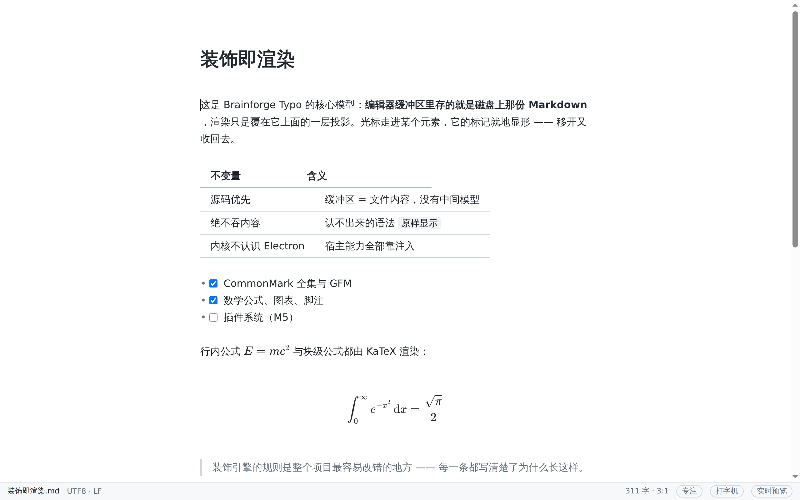

# Mosu

**简体中文** · [English](README.md) · [日本語](README.ja.md)

[](https://github.com/zning1994/mosu/releases/latest)
[](https://github.com/zning1994/mosu/actions/workflows/ci.yml)
[](#下载)
[](LICENSE)

一个开源的 Markdown 「所见即所得」编辑器 —— 无分屏、无预览窗格，写下的就是看到的。

> **状态：M2、M3、M4 完成，M4.5「硬骨头」六条全部落地**。
> GFM、数学公式、图表、大纲、命令面板、崩溃恢复、5 套主题、
> HTML / PDF 导出、复制为富文本、粘贴 HTML 自动转 Markdown、表格编辑、
> 文件树、多标签页、会话恢复、设置面板、行内 HTML 渲染都已可用。
> 其中三条是**缩范围 / 换做法**的版本，各自明确没做的部分都写在路线图里。
> 下一步是 **AI 基座（M5）** —— 见[路线图](docs/design/08-roadmap.md)。
> 这一档原来是插件系统，2026-08 整个换掉了，理由在
> [ADR-0006](docs/adr/0006-ai-runtime-and-plugin-strategy.md)：**v1 不做开放插件系统，
> AI 是内置能力**。
>
> **[v0.2.0](https://github.com/zning1994/mosu/releases/latest) 已发布** —— 三个平台的安装包都有。
> macOS 那几个用 Developer ID 证书签了名并通过了 Apple 公证，双击就开。
> Windows 仍未签名，而那是**刻意的决定**而非欠着的工作，理由见下面。

---

## 这是什么

大多数 Markdown 编辑器是「左边源码 / 右边预览」。Mosu 走另一条路：
只有一个编辑区，标题、粗体、链接、图片都以最终形态呈现；
只有当光标进入某个元素时，它的 Markdown 标记才就地显形，供你直接编辑。

同类体验的商业产品是 [Typora](https://typora.io/)。本项目是一个**独立实现**：
不复用其代码、资源或界面素材，只借鉴「无缝实时预览」这一交互范式。

<picture>
  <source media="(prefers-color-scheme: dark)" srcset="docs/public/shots/zh/hero-dark.png">
  
</picture>

上面这张图是**脚本跑真应用拍的**（`pnpm screenshots`），不是设计稿 ——
表格的列宽、公式的排版都是产品自己算出来的。界面改了重跑一条命令就能更新，
所以它不会像手工截图那样悄悄过期。

**光标进入，标记才现身** —— 这是它跟「左边源码 / 右边预览」最本质的区别：

| 光标不在里面 | 光标进去 |
| --- | --- |
|  |  |

## 核心设计取向

| 取向              | 说明                                                                    |
| ----------------- | ----------------------------------------------------------------------- |
| **文件即真相**    | 编辑器缓冲区里存的就是磁盘上那份 Markdown 文本，没有中间私有模型，往返零损耗 |
| **本地优先**      | 工作区就是一个普通文件夹，不需要账号、不需要同步服务、不锁定数据           |
| **可嵌入的内核**  | 编辑器内核是纯 Web 库，不依赖 Electron，可以被浏览器、其他壳复用           |
| **扩展是一等公民** | 主题、语法扩展、面板都走公开 API，内置功能自己也用同一套 API              |

完整的目标 / 非目标见[设计总览](docs/design/00-overview.md)。

## 快速开始

需要 Node ≥ 20.19 与 pnpm。

```bash
pnpm install
pnpm dev          # 启动开发版（渲染进程带 HMR，main/preload 改动自动重启）
```

其他常用命令：

```bash
pnpm test         # 单元测试（含 CommonMark 全量语料的保真与不变量检查）
pnpm test:e2e     # 端到端测试（真 Electron + 真 Chromium，含输入法用例）
pnpm verify       # 提交前跑一遍：分层检查 + 类型 + lint + 格式 + 单测
pnpm build        # 构建 main / preload / renderer
pnpm --filter @mosu/desktop package     # 打出当前平台的安装包
```

Linux 上跑端到端测试需要一个显示环境：`xvfb-run -a pnpm test:e2e`。

## 目前能做什么

**可以用了**

- CommonMark 全集的实时预览：标题、强调、行内代码、链接、图片、列表、引用、代码块、分隔线
- 光标进入元素即显源码，移开即还原；光标不会落进看不见的标记里
- 中日韩输入法在装饰区域内正常工作（有专门的回归用例守着）
- 打开 / 保存 / 另存为，原子写入，外部修改冲突检测
- 编码与换行风格保真：打开→保存后文件逐字节不变
- 加粗 / 斜体 / 行内代码 / 标题层级的快捷键，回车续列表，撤销重做，查找替换
- Ctrl / Cmd + 点击链接用系统浏览器打开（普通点击只定位光标）
- 源码模式一键切换
- **专注模式**（F8）：当前段落之外全部变暗；**打字机模式**（F9）：当前行常驻视口中央
- **界面语言**：简体中文 / English / 日本語，设置里随时切，不用重启
- **多窗口**：⌘N 新建窗口，⌘O 打开（当前窗口为空则复用），⌘⇧O 强制新窗口
- **代码块**：按语言语法高亮、不跟随散文折行、整块横向滚动，右上角可切换语言
- **GFM**：表格（真的按表格排版，列宽自动对齐）、可点击的任务列表、删除线、
  自动链接、脚注
- **数学公式**：行内 `$…$` 与块级 `$$…$$`，KaTeX 渲染（懒加载）
- **Mermaid 图表**：```` ```mermaid ```` 围栏直接出图（懒加载）
- **YAML front matter**：带 YAML 高亮，没写收尾 `---` 时不会把全文吃掉
- **图片**：粘贴 / 拖入自动存进文档旁边的 `assets/`，插入相对路径
- **大纲面板**（⌘⇧E）与**命令面板**（⌘⇧P）
- **文件监听**：外部改动无冲突时静默重载，有冲突才问你
- **崩溃恢复**：未保存内容 500ms 防抖写草稿，下次启动询问是否恢复
- **5 套主题 + 跟随系统**：浅色 / 深色 / 护眼 / 高对比 / GitHub，带打印样式
- **导出为 HTML**：自包含单文件 —— 样式、图片、公式字体、图表 SVG 全内联，
  发出去双击就能看；文档里的 `<script>` 默认被消毒掉
- **复制为富文本**：粘进邮件 / 飞书 / Word 格式不散
- **粘贴 HTML 自动转 Markdown**：从网页 / Word / Google 文档复制过来保住格式；
  从代码编辑器复制过来则原样按纯文本插入（转了只会把代码拆成一堆段落）
- **表格编辑**：Tab 跳单元格、增删行列、设置列对齐、一键整理（按显示宽度对齐，
  中文占两格）。每一条都是纯文本变换，撤销永远是对的
- **导出为 PDF**：复用 HTML 导出的产物交给 Chromium 打印，一律浅色，
  纸张 / 方向 / 页边距可在设置里调
- **文件树**（⌘⇧B）：打开一个文件夹，点一下在标签里打开
- **多标签页**（⌘T 新建 / ⌘W 关闭）：撤销栈与脏标记各自独立；
  关窗口时多个未保存文档汇总成一个对话框。标签上右键可以关闭其他 / 关闭右侧 /
  复制文件路径；⌘⌥S **保存全部**，存不下去的会列出来告诉你是哪几篇
- **右键菜单**：编辑区里按选区状态给出剪切 / 复制 / 粘贴 / 粘贴为纯文本 /
  全选 / 查找选中内容
- **会话恢复**：下次启动回到上次的工作区与标签
- **设置面板**（⌘,）：主题、新标签默认视图、行内 HTML 开关、PDF 的纸张 / 方向 / 页边距
- **快捷键可改**：设置里直接按下你想要的组合，撞车会标出来；改完原生菜单当场跟上
- **渲染行内 HTML**：`<b>` `<kbd>` `<sub>` `<mark>` `<br>` 那一小撮不带属性的标签
  按排版语义显示。**实现上一个字节的 HTML 都不进 DOM**（只挂类名），
  带属性的、白名单之外的、没闭合的一律按原文显示

**还没有**（按路线图排期）

- AI 能力（改写、翻译、总结、问文档）—— M5 / M5.5，一行还没写
- **开放插件系统 —— 决定不做**（v1）。不加载第三方代码；将来要开放的是受控的
  Tool API，重估条件见 [ADR-0006](docs/adr/0006-ai-runtime-and-plugin-strategy.md)
- 用户主题目录与热加载（M4 顺延）
- Pandoc 导出（DOCX / ePub / LaTeX）
- 渲染块级 HTML（`<div>…</div>`）—— 这条是**决定不做**，不是排期问题：
  它的意义几乎全在属性上，而属性正是「一个字节 HTML 都不进 DOM」那套做法
  绕不开的地方（02 §5.1、03 §3.1）
- 表格拖拽调列宽、PDF 的页眉页脚与目录页码、文件树里的拖拽移动
  （各自所在功能**明确没做**的部分，同样见路线图）

已知的粗糙之处都记在[路线图](docs/design/08-roadmap.md)各里程碑末尾的「实际偏差」里，
不藏着掖着。

## 下载

三个平台的安装包都在[最新 release](https://github.com/zning1994/mosu/releases/latest)。

| 你的机器 | 拿哪个 |
| --- | --- |
| macOS，Apple Silicon | `Mosu-<版本>-arm64.dmg` |
| macOS，Intel | `Mosu-<版本>-x64.dmg` |
| Windows | `Mosu-<版本>-x64.exe`，Arm 机器用 `-arm64.exe` |
| Windows，不确定架构 | `Mosu-<版本>.exe` —— 两种架构都装在里面，体积翻倍 |
| Windows，不想安装 | `Mosu-<版本>-x64-portable.exe` |
| Linux | `Mosu-<版本>-x86_64.AppImage`，或者 `.deb` / `.tar.gz` |

macOS `.dmg` 旁边那几个 `.zip`、以及 `latest*.yml`，是留给将来自动更新用的，你不需要。

**macOS 的包已签名并公证。** 双击就开，不会被 Gatekeeper 拦，也不用 `xattr`。

**Windows 的包没有签名。** SmartScreen 会提示「Windows 已保护你的电脑」，
点「更多信息」→「仍要运行」。这一关是**刻意先不解决**而不是还没做：跟 macOS 不同，
签了名也不代表不弹窗 —— 普通证书要靠安装量积累「声誉」，立刻生效的 EV 证书又贵、
还得配云签名服务。账算不过来，理由见 [07 §6.2](docs/design/07-quality.md)。

**Linux** —— AppImage 需要先加执行权限：

```bash
chmod +x Mosu-*.AppImage && ./Mosu-*.AppImage
```

## 试用还没发布的版本

每次推到 `main`，[Actions](https://github.com/zning1994/mosu/actions) 里也会产出安装包 ——
每个平台一种格式，用来试某一个具体的提交。页面上显示的 `mosu-macos-arm64-dmg` 这类名字
是**产物包**的名称，不是文件名，GitHub 一律把产物打成 zip，解开之后才是 `.dmg`。

**这些包都没有签名，macOS 也一样** —— 签名证书只对发布流水线可用。所以在 macOS 上
会提示「Apple 无法验证"Mosu"是否包含恶意软件」。应用没问题，只是没有经过公证。
两种放行办法：

```bash
# 办法一：右键点应用 → 打开 → 在弹窗里再点一次「打开」
# 办法二：直接去掉 quarantine 标记（路径含空格，引号不能省）
xattr -dr com.apple.quarantine "/Applications/Mosu.app"
```

## 仓库结构

```
packages/
  plugin-api/   宿主接口与公开类型（HostBridge、内存实现）
  markdown/     文本保真编解码、Lezer 语法配置、大纲派生
  editor/       实时预览内核（装饰引擎、命令、主题、表格编辑）
  import/       HTML → Markdown（粘贴富文本）
  export/       Markdown → HTML（导出、复制为富文本、PDF 的上游）
apps/
  desktop/      Electron 壳（main / preload / renderer）
e2e/            Playwright 端到端测试
docs/           设计文档与架构决策记录
```

依赖方向严格单向向下，由 `pnpm layers` 在 CI 里强制。

## 官网与文档站

官网与设计文档：<https://mosu.ohgiantai.com>（VitePress，带搜索与导航）。
本地预览：

```bash
pnpm docs:dev
```

## 文档索引

**设计文档**

| 文档                                                   | 内容                                     |
| ------------------------------------------------------ | ---------------------------------------- |
| [00 总览](docs/design/00-overview.md)                   | 产品定位、目标与非目标、设计原则          |
| [01 架构](docs/design/01-architecture.md)               | 仓库结构、进程模型、模块边界、安全模型    |
| [02 编辑器内核](docs/design/02-editor-core.md)          | 实时预览的实现模型（本项目最核心的部分）  |
| [03 Markdown 管线](docs/design/03-markdown-pipeline.md) | 双解析器策略、往返保真、语法扩展          |
| [04 文件与工作区](docs/design/04-files-and-workspace.md) | 原子保存、文件监听、崩溃恢复、全文搜索    |
| [05 主题与扩展点](docs/design/05-themes-and-plugins.md) | 主题契约、扩展点、设置                    |
| [06 导出](docs/design/06-export.md)                     | HTML / PDF / DOCX / LaTeX 导出管线        |
| [07 质量基线](docs/design/07-quality.md)                | 测试策略、性能预算、无障碍、国际化        |
| [08 路线图](docs/design/08-roadmap.md)                  | 里程碑拆分与验收标准                      |
| [09 分发](docs/design/09-distribution.md)               | 直接分发 / App Store / 定价的取舍          |
| [10 AI](docs/design/10-ai.md)                           | Tool Registry、Patch 协议、Provider（⬜ M5） |

**架构决策记录（ADR）**

| ADR                                          | 决策                              |
| -------------------------------------------- | --------------------------------- |
| [0001](docs/adr/0001-desktop-shell.md)        | 桌面壳选 Electron 而非 Tauri       |
| [0002](docs/adr/0002-editor-core.md)          | 编辑器内核选 CodeMirror 6 而非 ProseMirror |
| [0003](docs/adr/0003-dual-parser.md)          | 编辑解析器与语义解析器分离         |
| [0004](docs/adr/0004-plugin-isolation.md)     | 插件隔离与权限模型（**已搁置**）    |
| [0005](docs/adr/0005-windows-and-tabs.md)     | 窗口与标签页的关系                 |
| [0006](docs/adr/0006-ai-runtime-and-plugin-strategy.md) | AI 是核心能力，插件系统延期 |

**实测记录**

| 文档                                                | 内容                                         |
| --------------------------------------------------- | -------------------------------------------- |
| [已知差异](docs/known-divergences.md)                | 两个解析器在 652 例官方语料上的 2 处不一致    |

## 参与开发

改代码前建议先读 [02 编辑器内核](docs/design/02-editor-core.md)——
装饰引擎的规则是整个项目最容易改错的地方，那份文档解释了每条规则为什么长这样。

提 PR 前请跑 `pnpm verify`。涉及装饰规则的改动，务必说明对格式保真的影响。

其余的都在 [CONTRIBUTING.md](CONTRIBUTING.md)（英文）：代码必须守住的三条规则、
一个改动该带上什么、以及为什么「在 Linux 上通过」的测试仍然可能是错的。
参与即表示你接受[行为准则](CODE_OF_CONDUCT.md)；安全问题走[私密报告](SECURITY.md)，
不要开公开 issue。

## 许可

[MIT](LICENSE)
