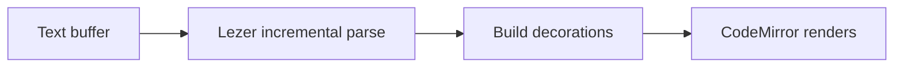

# Decorations Are the Rendering

This is the core model of Brainforge Typo: **the editor buffer holds exactly the Markdown that is on disk**, and the rendering is just a projection laid over it. Move the cursor into an element and its markers reappear in place — move away and they fold back.

| Invariant             | What it means                              |
| --------------------- | ------------------------------------------ |
| Source first          | Buffer = file contents, no intermediate model |
| Never swallow content | Unrecognised syntax is shown `verbatim`    |
| Core knows no Electron | Host capabilities are injected            |

- [x] Full CommonMark and GFM
- [x] Math, diagrams, footnotes
- [ ] Plugin system (M5)

Inline math $E = mc^2$ and display math both render through KaTeX:

$$
\int_{0}^{\infty} e^{-x^{2}}\,\mathrm{d}x = \frac{\sqrt{\pi}}{2}
$$

> The decoration rules are the easiest part of this project to get wrong — every one of them documents why it looks the way it does.

## Pipeline

Decoration building is a pure function, testable without a DOM:

```ts
export function computeDecorations(state: EditorState) {
  const b = new Builder(state, activeState(state))
  syntaxTree(state).iterate({ enter: (n) => handleNode(b, n) })
  return Decoration.set(b.decorations, true)
}
```


