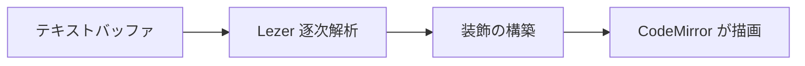

# 装飾がそのまま描画になる

これが Brainforge Typo の中核モデルです。**エディタのバッファには、ディスク上の Markdown がそのまま入っています。** 描画はその上に重ねた投影にすぎません。カーソルがある要素に入ると、その記法だけがその場に現れ、離れるとまた畳まれます。

| 不変条件                     | 意味                                     |
| ---------------------------- | ---------------------------------------- |
| ソースが第一                 | バッファ = ファイルの中身、中間モデルなし |
| 内容を飲み込まない           | 解釈できない記法は `そのまま` 表示       |
| コアは Electron を知らない   | ホストの機能はすべて注入で渡す           |

- [x] CommonMark 全体と GFM
- [x] 数式・ダイアグラム・脚注
- [ ] プラグイン機構（M5）

インライン数式 $E = mc^2$ もブロック数式も KaTeX で描画されます。

$$
\int_{0}^{\infty} e^{-x^{2}}\,\mathrm{d}x = \frac{\sqrt{\pi}}{2}
$$

> 装飾ルールはこのプロジェクトで最も壊しやすい部分です。だからこそ一つひとつに「なぜこの形なのか」を書き残しています。

## パイプライン

装飾の構築は純粋関数なので、DOM なしでテストできます。

```ts
export function computeDecorations(state: EditorState) {
  const b = new Builder(state, activeState(state))
  syntaxTree(state).iterate({ enter: (n) => handleNode(b, n) })
  return Decoration.set(b.decorations, true)
}
```


