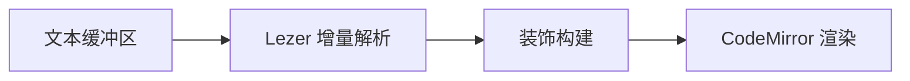

# 装饰即渲染

这是 Brainforge Typo 的核心模型：**编辑器缓冲区里存的就是磁盘上那份 Markdown**，渲染只是覆在它上面的一层投影。光标走进某个元素，它的标记就地显形 —— 移开又收回去。

| 不变量              | 含义                            |
| ------------------- | ------------------------------- |
| 源码优先            | 缓冲区 = 文件内容，没有中间模型 |
| 绝不吞内容          | 认不出来的语法 `原样显示`       |
| 内核不认识 Electron | 宿主能力全部靠注入              |

- [x] CommonMark 全集与 GFM
- [x] 数学公式、图表、脚注
- [ ] 插件系统（M5）

行内公式 $E = mc^2$ 与块级公式都由 KaTeX 渲染：

$$
\int_{0}^{\infty} e^{-x^{2}}\,\mathrm{d}x = \frac{\sqrt{\pi}}{2}
$$

> 装饰引擎的规则是整个项目最容易改错的地方 —— 每一条都写清楚了为什么长这样。

## 管线

装饰构建是纯函数，可以脱离 DOM 单测：

```ts
export function computeDecorations(state: EditorState) {
  const b = new Builder(state, activeState(state))
  syntaxTree(state).iterate({ enter: (n) => handleNode(b, n) })
  return Decoration.set(b.decorations, true)
}
```


